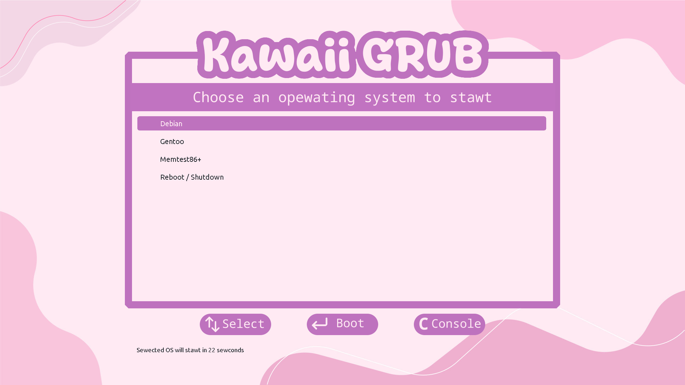

# MenheraOS

Arch-based kawaii OS.

## What is MenheraOS?
MenheraOS is the most Kawaii OS. It's based on [Arch Linux](https://archlinux.org/) and has
[additional pacman repo with kawaii packages](https://wiki.archlinux.org/title/Unofficial_user_repositories#kawaii).
There are some some packages with useful utilites (e.g. [what-anime-cli](https://github.com/irevenko/what-anime-cli))
and DE themes.

MenheraOS uses [Kawaii Desktop Environment](https://kde.org/) and has kawaii pre-installed color themes,
wallpapers, SDDM screens and more over.

Also it has graphical installer based on [Calamares](https://calamares.io/), so installing it will be
much easier than Arch Linux. Also you can test Menhera OS without installing when booting from USB stick.

MenheraOS uses [Zsh](https://www.zsh.org/) as default shell. There is also pre-installed
[Oh My Zsh](https://ohmyz.sh/) package with
[kawaii color scheme](https://github.com/LeonidPilyugin/kawaii-oh-my-zsh)
and git, autocomplete and syntax-highlight plugins.

You can see some some previews below.




## How to install MenheraOS?
For a start, download the latest MenheraOS ISO from releases. Also you can build it yourself but we don't recommend it because there may be problems between installer and new packages.
Then, [create a bootable USB stick](https://ubuntu.com/tutorials/create-a-usb-stick-on-windows#1-overview).
After that, [boot from USB](https://www.acronis.com/en-us/blog/posts/usb-boot/) and when system load,
click on "Install" label on desktop and follow instructions.

> [!WARNING]
> It is recommended to test installation in virtual machine and backup your system before installing MenheraOS on your computer, because the installation process may be not tested enough.
> Also try some basic actions like system update and regenerate initramfs image in VM.

## How can I build ISO myself?
We do not recommend to do it, because usually we cannot update installer package timely, so there will
be troubles with installation.

But if you want to do that, follow instructions below.

Firstly, install [archiso](https://wiki.archlinux.org/title/Archiso).

Secondly, clone this repo
```
$ git clone https://github.com/LeonidPilyugin/menheraOS.git
```

Finally, run mksio script as root from project root
```
$ cd menheraOS
$ sudo bash mkiso
```

The `.iso` file will be placed in created "out" directory.
